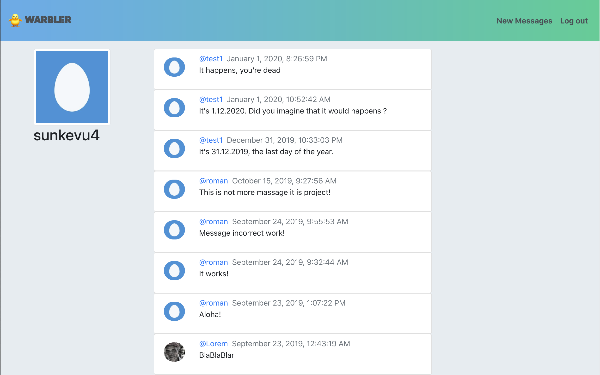

# warbler – twitter based app

## How it look like


## Start frontend

```bash
cd warbler-client
npm start
```

## Start backend

1. Run MongoDB(Mac OS)

```bash
./mongodb/bin/mongod --dbpath=/Users/sunkevu4/data/db --
```

2. In new Terminal run Node.js

```bash
node index.js
```
